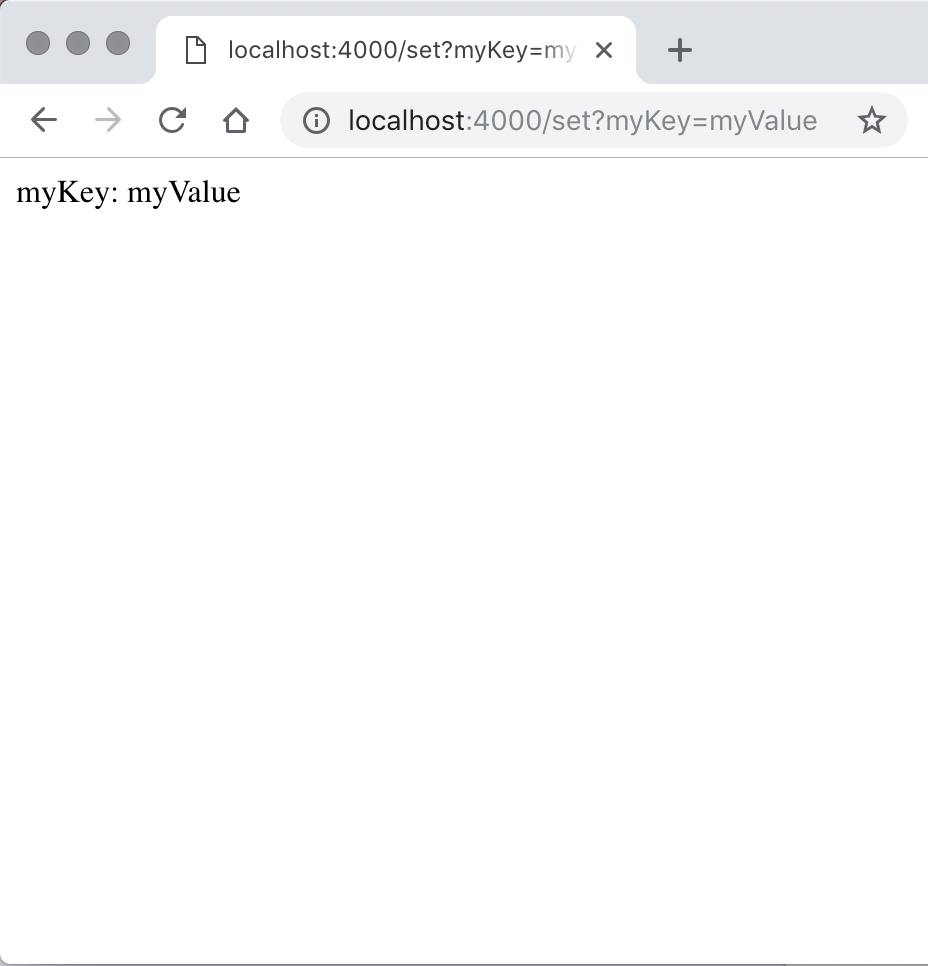
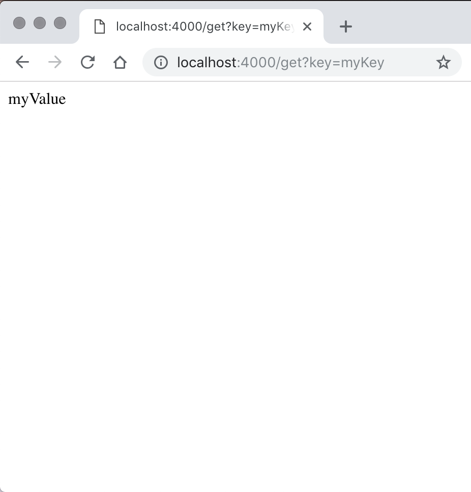

# DatabaseServerTechTest
My attempt at the database server tech test, using Node.js and Express.js to serve my code and store data. I used Cypress for feature testing and Jasmine for unit testing.

## The Brief
> "Before your interview, write a program that runs a server that is accessible on http://localhost:4000/. When your server receives a request on http://localhost:4000/set?somekey=somevalue it should store the passed key and value in memory. When it receives a request on http://localhost:4000/get?key=somekey it should return the value stored at somekey. Store the data in memory, not in a database, but bear in mind that you will later need to add a database to this code. We will be looking for clean, well tested code in your choice of technology."

## My approach
I decided to use Node.js and its Express package for this tech test. Express is suitably lightweight, allowing for clean and concise code, and integrates perfectly with other Node modules for parsing URLs, for example (as I used in this project). I decided to use Cypress for end-to-end feature testing, because it's fast, reliable, and easy to use. While this means feature and unit tests have to be run separately, I believe that I used the right tools for each job. I used ESLint to lint my code and Istanbul for code coverage reports (100% coverage currently).

My app is formed of three components: the `server.js`, the `DataManager`, and the `DataStore`. The `server` contains the Express routing for `/set` and `/get` requests; it parses the URL to extract the query params, and passes the params into an instance of the `DataManager`. The `DataManager` is a class with `set` and `get` methods, each of which interacts with the `DataStore` object to store or retrieve data. The `set` method parses the key and value from the parameters and passes it to the `DataStore`; the `get` method parses the key from the parameters then queries the `DataStore` for the associated value. The `DataStore` has read and write methods that store and retrieve data from its `data` object's properties.

When the user stores a key/value pair at `/set`, they will get the pair back in the response. When they retrieve a value with `/get`, the response will be the value associated with the specified key.

My code could be easily extended to account for a database: if required, I could use MongoDB's Node.js driver, and execute its `insertOne` and `find` methods inside my `DataManager`'s `set` and `get` methods to store and retrieve the relevant data, instead of using the `DataStore` object.

## How to use the app

- Clone the repository
- `npm install`
- `npm test` to run the unit tests
- `npm run cypress:open` to run the feature tests
- `npm start` to start the server at `http://localhost:4000`
- Visit the server with `/set`, plus a query string (for example: `/set?myKey=myValue`), to store the key/value pair in local memory.
- Visit the server with `/get?key=`, plus the desired key (for example: `/get?key=myKey`) to retrieve the value of the specified key.

## Screenshots
Here are screenshots of sending requests to the `/set` and `/get` URLs with a key/value pair.

